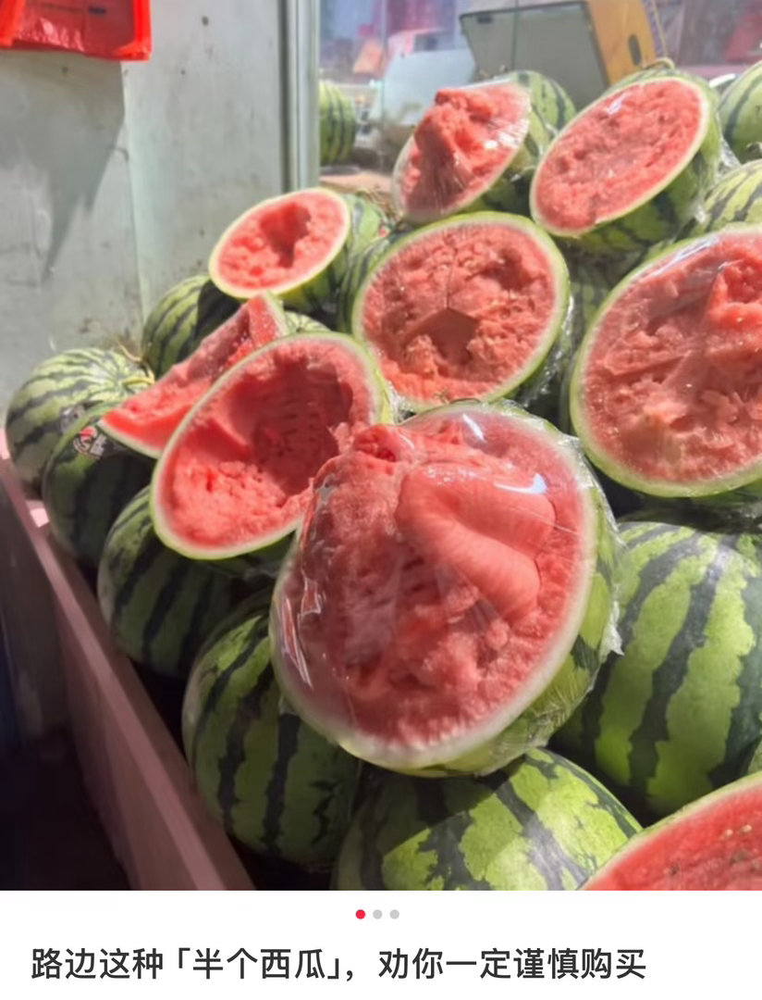
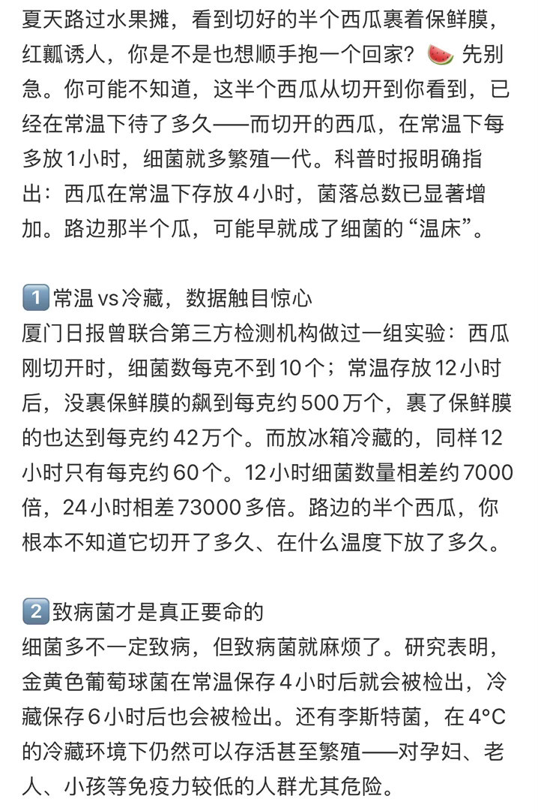

# 千万不要买路边切好的半个西瓜

昨天热搜上一条话题刷屏了：千万不要买路边切好的半个西瓜。我当时第一反应是，又来吓人了吧？夏天吃个半个瓜怎么了，方便，份量刚好，勺子一挖就开吃，比啃整个的爽多了。

然后我翻了一下评论区。

有人发了个视频，在路边水果摊买了个半切西瓜，回家一挖，最中间那块已经软了，闻着隐隐有点酸。评论区炸了——"我上次买的半个西瓜，第二天拉了三回""吃完蹿稀到腿打颤""我以为是肠胃脆弱，现在才知道可能是瓜的问题"。

好吧，我改主意了。

澎湃那篇科普文章说得很直白：西瓜贴地生长，表皮天然带菌，土壤、灌溉水、农家肥都可能让瓜皮携带致病菌。切瓜前不洗皮，一刀下去，细菌从果皮直接被"快递"到果肉里。你在家切瓜，老妈至少会先冲一遍，用的也是蔬果专用砧板。路边摊呢？同一把刀刚削过甘蔗，可能还切过荸荠，砧板上一个月的残留都在，刀面接触面积越大，交叉感染越猛。

西瓜果肉含水量高，糖分足，酸度低。被切开的那一刻，果皮保护没了，细菌开始疯狂侵染，简直就是自助餐厅。有实验数据：切开后的西瓜常温放6小时，每克果肉的细菌数量就超过国家安全标准了。12小时后，翻了好几倍。夏天动不动30多度，完美命中致病菌的繁殖温区。

老板包了层保鲜膜，也无济于事。保鲜膜只防尘，不杀菌。封包时内部已经带菌了，反倒营造了个高湿密闭的环境，让金黄色葡萄球菌之类的指数级繁殖更猛。你以为是保鲜，其实是加速变质。

2024年国家食品安全风险评估中心发了一组数据：218份鲜切水果样品里，西瓜的总致病菌检出率3.21%，主要检出金黄色葡萄球菌、大肠杆菌和单核细胞增生李斯特菌。2021年上海的数据更扎眼——鲜切西瓜致病菌检出率13.85%。也就是说，你买到的那半个瓜，有将近14%的概率带着致病菌。

我以前也买过。下班路过水果摊，看着那半个红彤彤的西瓜，9块9，觉得划算，拎回家拿勺子挖着看剧，一口气吃完。没拉肚子，觉得自己运气好。现在回头看，几次侥幸不等于次次幸运。

说到底，不是西瓜本身有毒，是切开以后的时间和处理方式有毒。你买整瓜回家，自己洗自己切自己吃，全程可控。路边那半个，你根本不知道它被切开多久了，刀干净吗，砧板干净吗，保鲜膜是刚包的还是包了好几个小时了，冰柜里是不是跟生肉混放着——每一个环节都是问号。

现在小西瓜品种很多，特小凤、黄小玉之类，个头1到2斤，一个人刚好吃完。嫌麻烦的话就买这种，不用切，不用担心。非要买大瓜，那就买整的，回家洗了再切。切开后两小时内包好放冰箱，冷藏别超过16小时。

夏天嘛，西瓜该吃。只是吃法要注意。路边的半个瓜看着方便，方便背后也暗中标好了代价。
