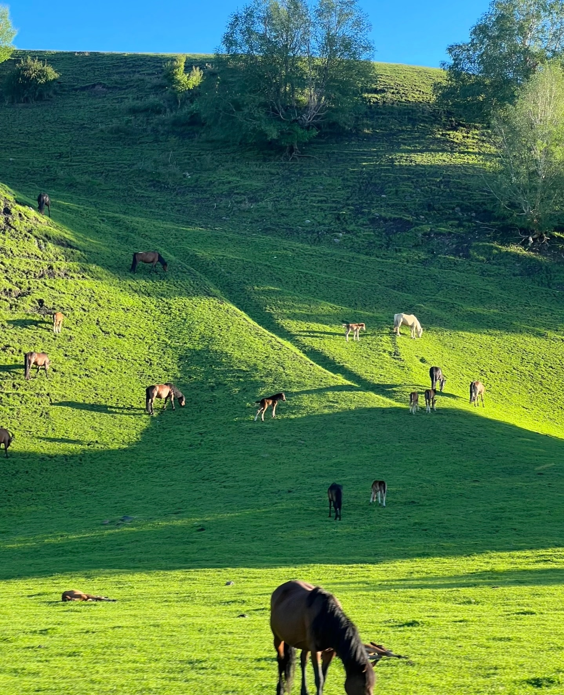
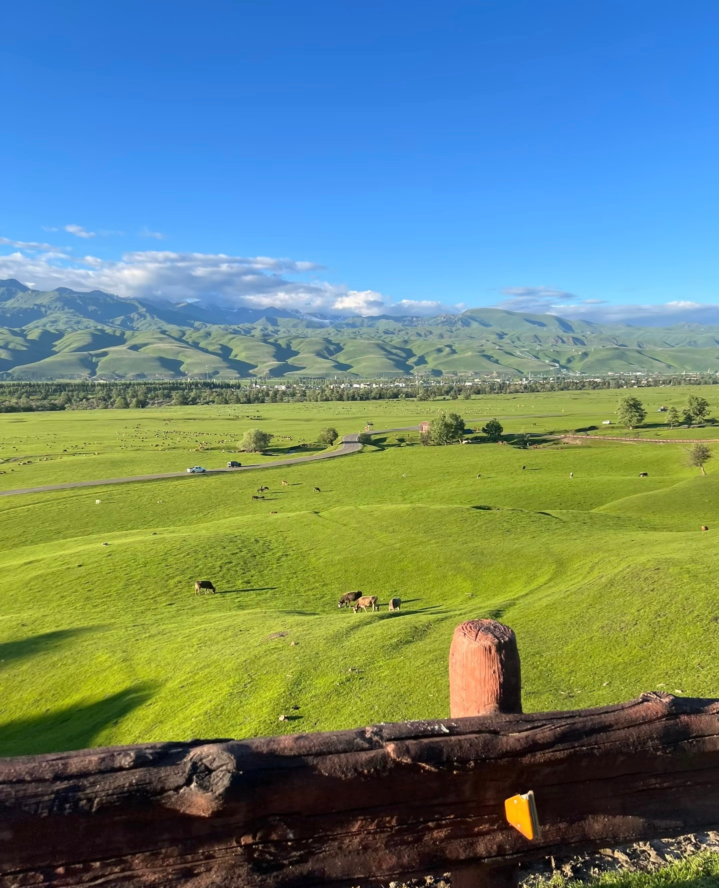
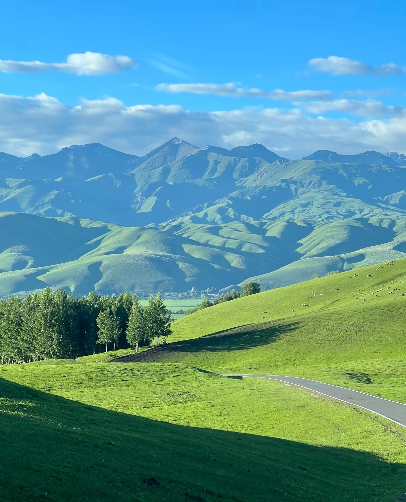

# 新疆旅游在韩国火了起来，但我最在意的是评论区那句话

刷微博热搜看到一条，新疆旅游突然在韩国火了起来。热度54万，不算顶流，但评论区有一条让我愣了。

"有种不祥的预感，好怕新疆特色会被他们拿去申遗。"

发帖的人没加任何表情包，也没激动，就那么干巴巴一句。点赞272。

我当时第一反应，什么年代了还纠结这个。但转念一想，正因为是自己人，才会这么敏感。

往前翻帖子，韩国人确实在组团来新疆。有个叫"南归孤夷"的博主带了几位韩国游客走一圈，对方全程"哇塞"，消费不错还请了翻译，评价是"眼睛舒服，鼻孔也舒服，天堂吧"。另一个韩国博主第一次到阿勒泰，说太舒服了下次带家人来。还有人拍了韩国人在新疆吃杏子的视频，标题就一句"韩国人第一次吃新疆杏子"，那条帖子点赞102，评论区都在讨论新疆水果到底有多便宜——韩国网友算了下，西瓜在首尔卖3000韩元一个，到了新疆8块钱能买三个。

说实话看到这些我心情挺复杂的。

新疆确实美。那拉提的草原、天山的雪山、喀纳斯的湖水，这些东西不需要任何人的认证，它就在那里。韩国人发现了，说明好东西被人看见了，这是好事。但评论区那句"申遗"的担忧也不是完全空穴来风，韩国人在文化申报这件事上确实有一些"前科"，也难怪大家神经紧绷。不过我翻了好几条帖子，发现大部分讨论都在两个极端：要么"韩国人来了快跑"，要么"让他们看看中国有多美"。却很少有人聊一个很实际的问题，韩国人来新疆，体验到底怎么样？

有个叫"男大修炼手册"的博主说得挺实在：以前外国人最喜欢的中国自然风光是张家界和桂林，一个有独特性，一个有电影宣传。如今新疆大草原终于突破国际视野了，比欧洲大也比欧洲自由。

这让我想到一个事。韩国人以前来中国，路线固定得像个模板，「北京故宫、上海外滩、成都火锅」。现在终于有人抬头往西看了，一看吓一跳，原来中国这么大。植物学博士史军在马来西亚转发了这条热搜，配了6张新疆风光照，说"新疆的独特景观多样性太高了，来新疆相当于去了欧洲和美国"。

事实就是这样。中国不只是火锅和熊猫。

西边有草原、有雪山、有沙漠、有烤肉、有馕、有维吾尔族大叔的笑脸。这些东西一直都在，只是以前没人看。现在有人看了。

至于申遗不申遗的，新疆的馕、新疆的歌舞、新疆的风景，哪一样不是我们的？别人看到了，不代表就是他们的。真正该紧张的，有没有把好东西保护好，有没有让来的人觉得值。

毕竟风景不会自己说话。

