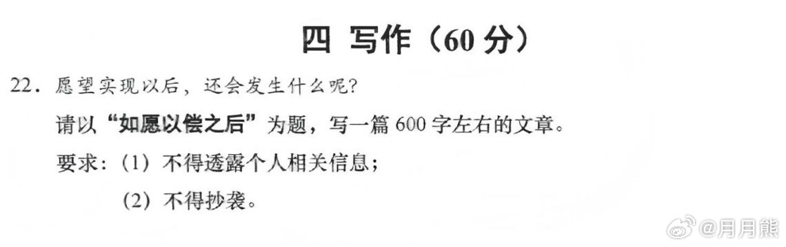
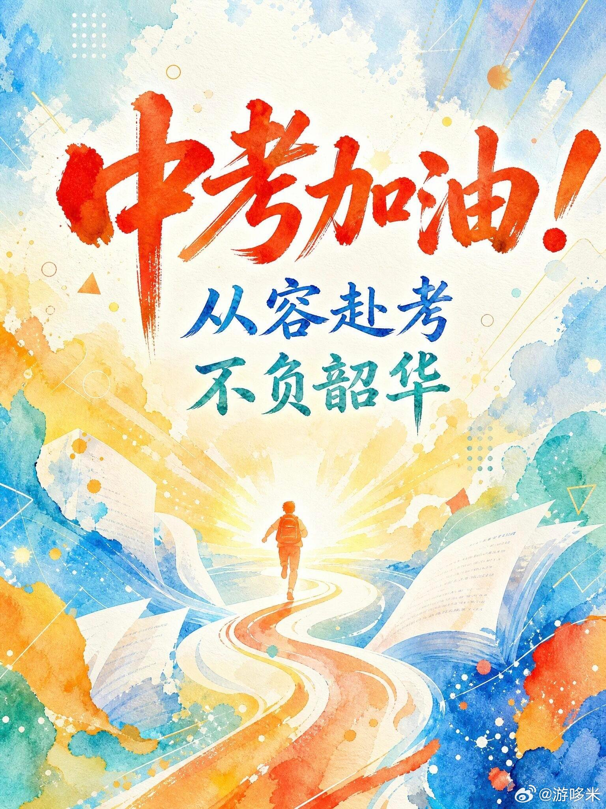

# 上海中考作文题，终于不写挫折了

今年上海中考语文作文题出来了：《如愿以偿之后》。

题目就一句话，愿望实现以后，还会发生什么呢？600字左右。

我看到这条消息的时候正在刷微博，第一反应是：这题出得有点意思。

过去二十年，中考作文题基本上是一个套路：写挫折、写失败、从跌倒中爬起来。《那一刻，我长大了》《原来，我也很坚强》《面对____的时候》，你随便翻翻各省市历年的题目，大部分都在教孩子"如何面对不如意"。

不是说这些题不好。但说实话，写多了也麻了。一个十四五岁的孩子坐在考场里，面对"请写一篇关于挫折的作文"，脑子里翻来覆去就那几个素材。考试失利、和朋友闹矛盾、学骑自行车摔了一跤。写完了自己都不想看第二遍。

今年上海这个题不一样。它问的是：然后呢？

你如愿以偿了，然后呢？

这才是真问题。

我翻了一下微博上的讨论，有个博主说得挺到位："以往的初中作文训练都刻板地要求写挫折，好了，今年写成功以后咋办呢？"评论区一下炸了，有人说这题好，有人说这题难。有个初中语文老师发了一条，大意是学生练了三年的"先抑后扬"，突然让写"扬"之后的部分，很多孩子可能反而不知道怎么下笔了。

这话说得准。我们太习惯写"从低谷到高峰"的叙事了。低谷写得越惨，高峰来得越爽，结尾再升华一下，青春真好，未来可期。但人生不是只有这一种故事。更多的时候，你拿到了想要的东西，然后发现好像也就这样。

高考考上了理想的大学，开学一个月后发现室友打呼噜。谈了三年的恋爱终于在一起了，在一起三个月后开始为谁洗碗吵架。攒了两年的钱买了心心念念的相机，拍了十几次就扔角落里吃灰。

这不是丧，这是真实。

算路程。算费用。算时间。算到最后，算了不出门了。

一个十五岁的孩子，大概率还没经历过什么大的"如愿以偿"。但他一定经历过小的。攒零花钱买了想要的球鞋，穿上第一天就踩了水坑。期末考试进步了二十名，发现老妈的奖励是"下次考进前十"。这些够写了。而且比写挫折真实得多。

上海这个题好就好在，它不再预设人生是"从不好到好"的单行道。它承认了另一件事：人活着，不只是为了解决问题，还要面对问题解决之后冒出来的新问题。

考场作文终究是考场作文，学生大概率还是会写一个"愿望实现后发现新的挑战，然后继续努力"的正能量故事。框架还是那个框架，只是方向反过来了。但我私心希望有孩子敢写点不一样的。比如：我如愿以偿了，然后发现这根本不是我想要的。

这种诚实，比任何作文技巧都值钱。

今年中考语文已经陆续开考了，各省的作文题也在一个个揭晓。浙江卷是"一滴水的循环"，湖南卷的选材据说争议不小。每年这个时候作文题都会上热搜，不只是因为考生关心，更是因为这些题目像一面镜子。出题人觉得孩子应该想什么，社会觉得孩子应该成为什么样的人。

从写挫折到写成功之后，这个转变本身就是一个信号。

至于这个信号意味着什么，等考完试，孩子们自己会告诉我们。
