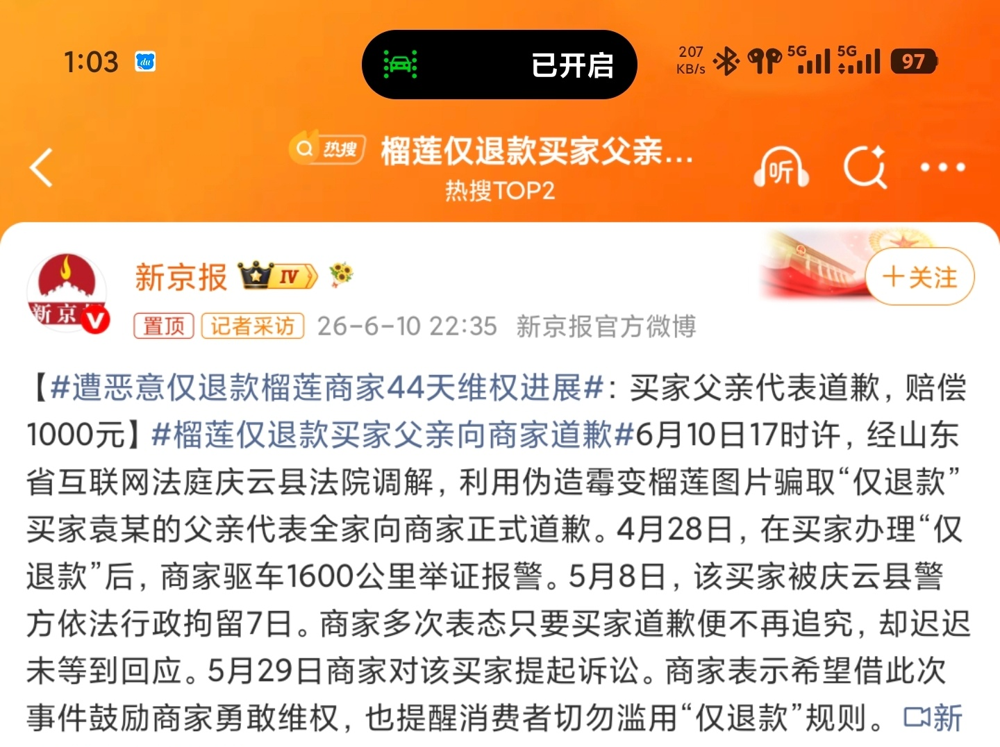
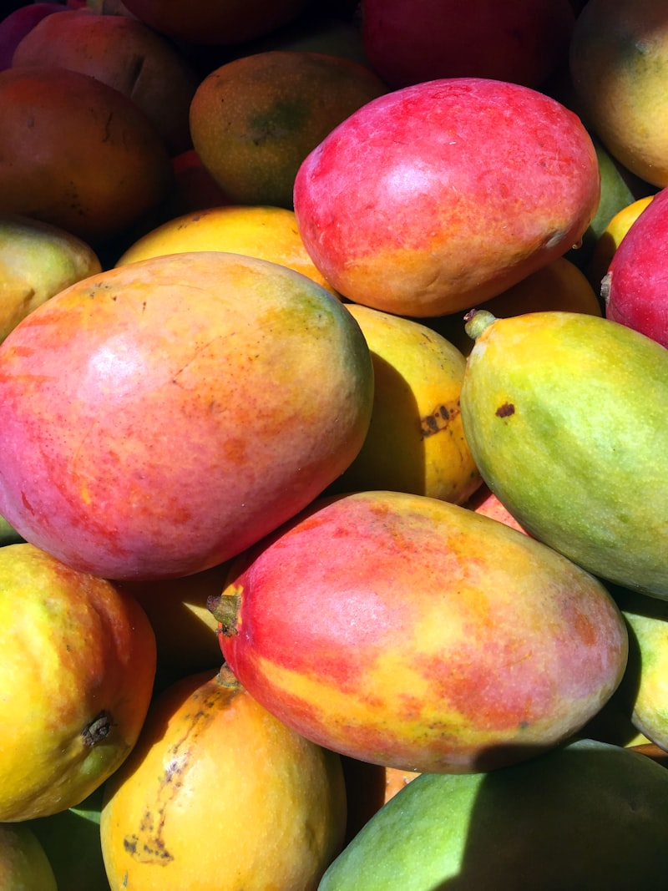
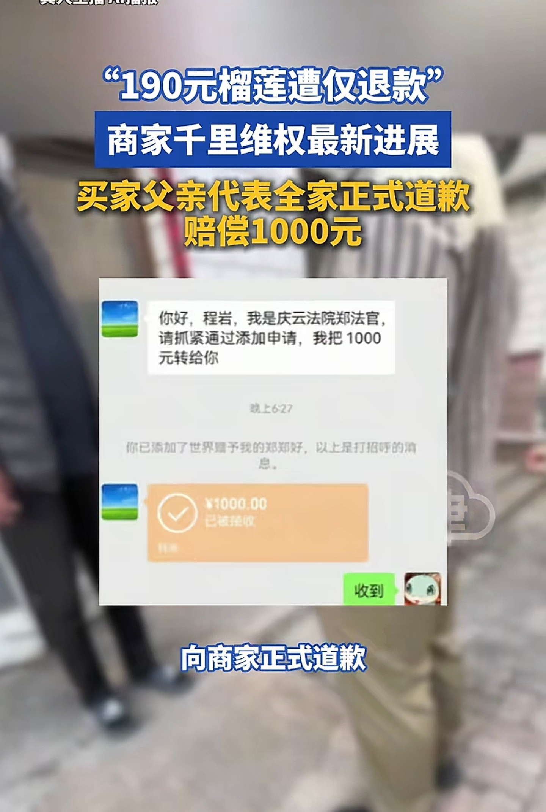

# 仅退款

刷微博刷到一条新闻，看到1600公里这个词，还以为是某种旅行攻略。

结果是一个榴莲商家为了讨个说法，从山东开到浙江，来回跑了三千多公里。

事情很简单。买家花190块钱买了个榴莲，收到之后申请了"仅退款"。平台秒批了钱退回去，买家什么都不用退。商家一看不对劲，去找买家，买家说"坏了扔了"。商家不信，调了物流信息，发现榴莲在签收的时候好好的。又查了买家的主页，发现这人干了好几次同样的事。

于是商家去报警了。

然后就是漫长的维权。44天。

6月10号，经山东庆云法院调解，买家的爸爸代表全家给商家道了歉，赔了1000块钱。买家本人从头到尾没出过面。

1000块。商家跑了一趟维权花的油费都不止这个数。

但事情上了微博热搜之后，评论区才是真正有意思的地方。新京报那条11000赞，底下800多条评论，吵成一锅粥。有人说这买家太过分了，有人说商家也太轴了为了190块跑那么远，也有人说平台才是最大的问题。

"仅退款"这三个字，在中文互联网上已经是一个自带火药味的词了。

简单说，就是电商平台的一项售后政策：买家如果对商品不满意，可以直接申请全额退款，而且东西不用寄回去。这个政策最早是拼多多搞出来的，时间大概是2021年。那会儿拼多多口碑不太好，假货多、客服态度差、售后体验拉胯，搞个"仅退款"算是给消费者打强心针。用意很明确：你在我这里买东西，不满意就退，我来兜底。

消费者当然开心。19.9的东西有问题，申请退款，第二天钱就到账了，连退货的快递费都省了。这在当时的淘宝和京东是没有的体验。

但商家呢？

我去年年底跟一个在拼多多开了三年水果店的朋友吃饭，聊到这个话题。他说他的"仅退款率"大概是12%。十个订单里有一个半被申请退款，东西退不回来，钱退回去了。"你知道水果这行利润本来就薄，一个榴莲利润可能就二三十块。被退一个，得再卖两个才赚回来。"

他没说的是，有些买家不是因为东西有问题才退款的。就是单纯想白拿。

"我们圈子里叫'薅羊毛'，"他喝了口酒，"有人专门研究怎么白嫖。教你怎么拍照片显得水果烂了，教你怎么描述客服才会秒批退款，甚至有QQ群专门交流话术。"

新京报报道的这个案子不是个例。就在同一天，微博上还有一条：有人利用仅退款机制骗了商家1000多次，买了1100件商品，退款了1000件，白嫖了5万多块钱。骗来的货物堆满了整个房间。最后被抓了。

5万多。一千多次。

但最让人膈应的不是这些个案。是你算一下账，会发现整个模式的利益分配是扭曲的。

拿这个榴莲案子来说。买家花了190块。商家进货一个榴莲大概100到120块，运费要15到20块，平台抽成加推广费大概10到15块，剩下的利润就二三十块。买家仅退款之后，商家不光没挣到这个钱，还把本钱搭进去了。平台呢？它什么损失都没有——退款的钱是商家的，平台只是在自己的系统里按了一下"通过"而已。平台靠这个机制省掉的客服人力成本，按行业平均数算，一年大概是好几亿。

所以平台当然乐意搞仅退款。客户满意度提升了，订单量上去了，运营成本还降了。至于这钱谁来出？反正不是平台。

成本一转嫁，就全砸在商家头上。

有一个数据我印象很深：2024年，仅拼多多一家，日均处理的仅退款订单就超过200万单。按平均每单金额30块算，每天6000万的资金流向被判定"无需退货"。大部分确实是问题商品退款，但哪怕只有1%是恶意退款，那也是每天60万白白流走。

商家怎么扛？

也不是没有反抗。2024年年中，拼多多上有一波商家集体行动，几千个店铺互相给自家商品刷一星差评，来抗议平台的仅退款政策太偏袒消费者。还有商家在社交媒体上说被仅退款逼到想不开。不管这些说法有没有夸大，它确实反映了商家群体的真实焦虑。

平台后来也意识到问题了。2024年底，淘宝宣布调整仅退款规则，引入信用评分机制，对信用好的买家继续无门槛退款，但信用一般的买家需要提供更详细的举证。拼多多和抖音也陆续跟进，加了申诉通道、限流、商家申诉机制。

但这些调整，说白了是被逼出来的。你不改，商家就跑；商家跑了，平台就没人卖货了。

前两天有篇文章讨论"内卷"问题，说中国电商的低价竞争已经到了商家互相压价、平台互相补贴、最后谁都不赚钱的恶性循环。仅退款是这个循环里的加速器之一。因为当退货成本变成零的时候，买家对商品质量的容忍度也跟着降到零。以前收到一个品相差的水果可能忍忍就算了，现在？直接退。

我有时候也矛盾。作为买家，我当然享受仅退款带来的便利。上次在拼多多买了个手机壳，到手发现尺寸不对，申请退款三分钟搞定，钱直接到零钱，我连快递都懒得叫。但我也知道，那个商家这单白干了。

这件事没有简单的对错。消费者要保护，商家也要保护。平台两头吃，还不愿意多花一分钱做审核。

厨子最怕的，不是食客挑嘴，是有人吃完一抹嘴说不好吃，不仅不付钱，还把别人的菜也端走了。

榴莲这个案子最后以道歉加赔1000块收场。商家说不蒸馒头争口气。买家从头到尾没出面，让年迈的老父亲代为道歉。

190块的榴莲，搞成这个样子。
