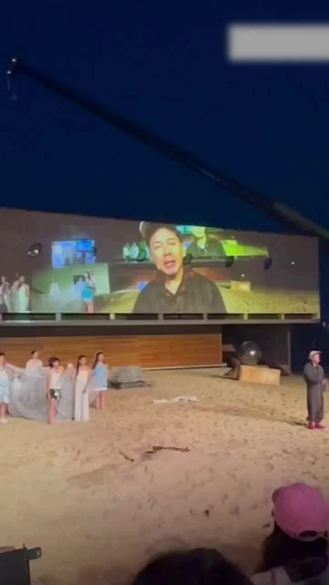
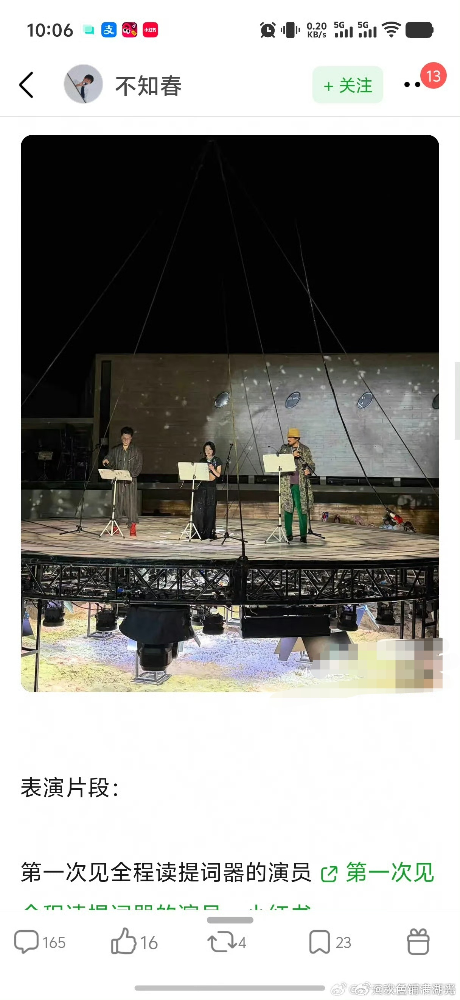
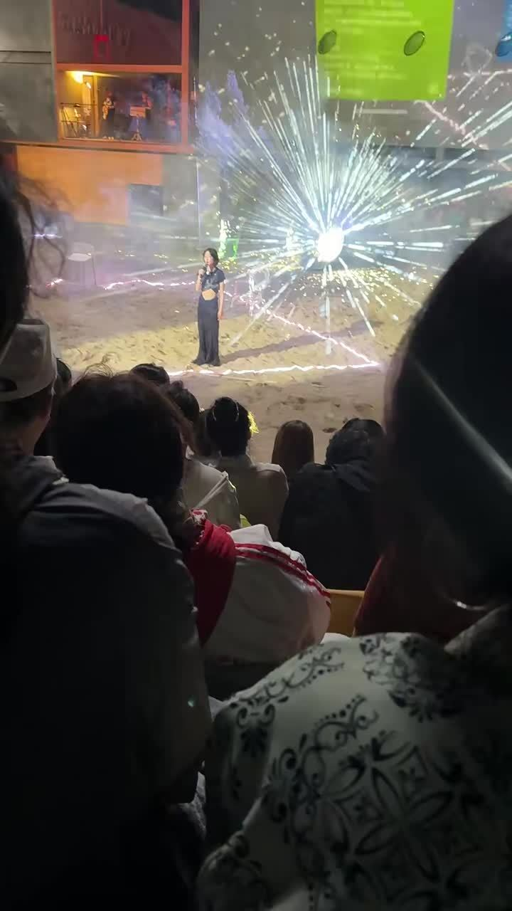

阿那亚戏剧节的话剧《文城》翻车了，翻得还挺彻底。

周冬雨、陈明昊、段奕宏，三个名字摆在一起看着挺唬人。余华小说改编，海边戏剧节首演，票价480到1280。看完的人发微博说，周冬雨从头到尾盯着提词器，后来干脆念台本了，念着还念错。陈明昊也念台本。段奕宏前面背了台词，后面也有一部分念的。三个人一起念台本，还念错了。

有个观众写长文，说周冬雨和陈明昊两个人一起笑场，态度差，仅认可段奕宏。另一位说"开始以为是谢幕，结果又演了将近半小时，后面 UFO 都来了，还可以闪迪斯科"。她还说，没有感觉到对观众基本的尊重。

票价1280是什么概念。

普通人攒着钱，坐火车去秦皇岛海边，买一张最贵的票，进剧场坐下来，看三个电影明星念台本。我看到这个价格的第一反应是，话剧票都这么贵了吗？然后第二反应是，你都卖这个价了还念台本？我花1280看人念台本，不如打开手机刷你们的电影，好歹还能暂停倒回去。

有粉丝说"谁都有状态不好的时候"。是，谁都有。但状态不好的时候可以请假，可以换人，可以退票。你站上台了，就说明你觉得准备好了。没准备好还上台，这不是状态问题，是态度问题。

说起来挺讽刺的。周冬雨是三金影后，金马金鸡金像都拿过，演技的口碑一直不差。但这几年作品少了很多，电影五年没进组，电视剧短板明显，好不容易有个话剧舞台的机会，台下全是专程买票来的观众，结果连台词都不背。影后这个头衔，以前是证明。现在像块牌匾挂在门口，进去一看，里面没装修。我在网上看了粉丝发的视频片段，周冬雨站台上眼神飘忽，连嘴型都对不上，说台词像在念课文。我当时的表情就跟她一样——茫然。

陈明昊的情况有点不一样。有人说他在阿那亚的一贯风格就是"形式大于内容"，导演比演员重要。听着像是在解释，但观众买票的时候可没收到这份说明。余华本人还参加过《文城》的读书活动，请了陈明昊做嘉宾，说改编这事看着挺认真的。结果上了台，认真就没了。不知道余华看到今天这个场面，会怎么想。那可是他的文城。

有人在评论区说"千万别营销成先锋艺术的表演效果"。这话不是没道理。你敷衍归敷衍，回头团队发个通稿说这是"解构式表演""沉浸式体验"，观众就更冤了。花了钱挨了糊弄，还被说不懂艺术。这已经有过先例了，内娱这套路观众见多了。

内娱太好混了。这话说了好几年，每次有个翻车的事就翻出来再说一遍。说完了也就说完了，下一次还是一样。拿着普通人一辈子赚不到的钱，连最基本的台词都不背，这事放到任何行业都叫不称职。放到娱乐圈，过两天热搜就下去了。

48块钱的奶茶你嫌贵，1280的票让你看提词器。
