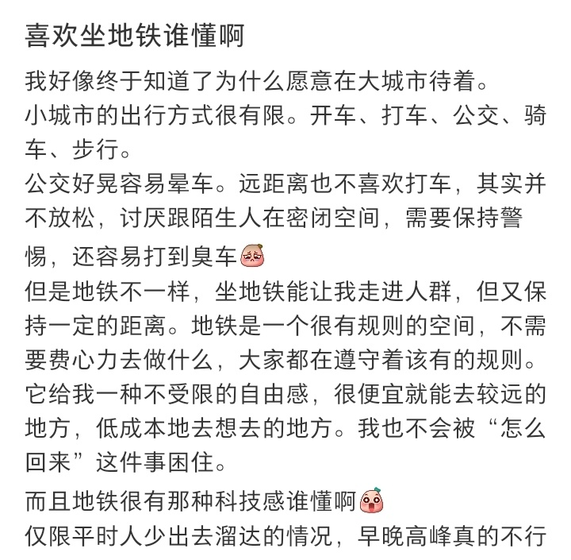
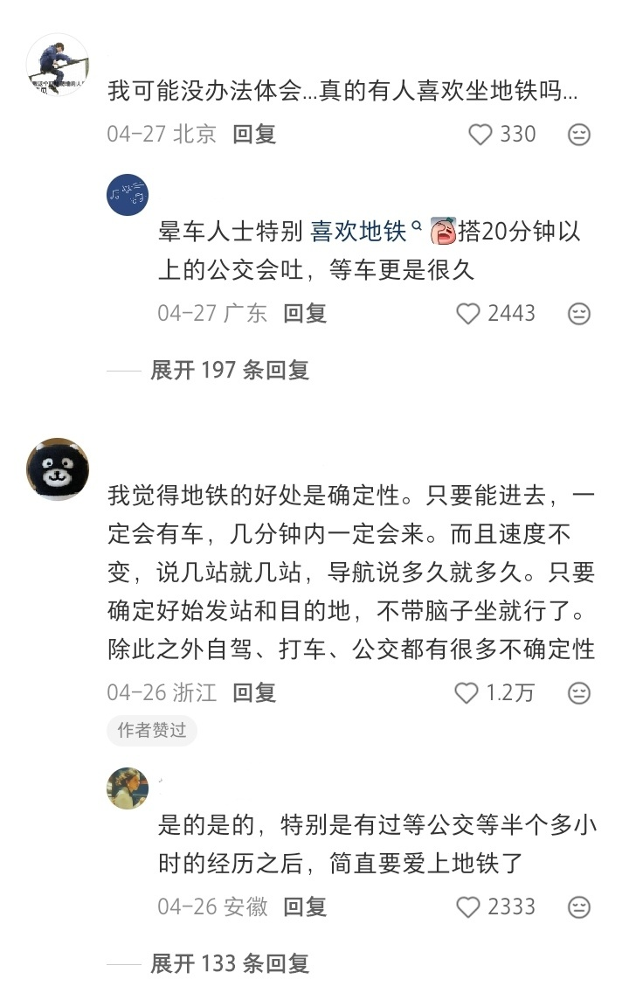

我第一次坐地铁是在上海，2018年。

那天我从虹桥站出来，拖着行李箱，在2号线上站了四十分钟。车厢里挤得我连手机都拿不出来，只能盯着头顶的线路图，数还剩几站。出了站之后我发现，刚才那四十分钟，如果打车，至少要一个小时半，还得花八十多块。

地铁四块钱。

这事我记得很清楚，不是因为省钱。是因为那之后我在上海待了三年，地铁彻底改变了我的出行习惯。想去哪儿，先查地铁能不能到。能到就走，不能到就想想能不能换乘。实在不行才打车。出门的门槛低到你根本不用想——拿个手机扫一下码，进站，到了。不用操心堵不堵车，不用心疼油钱停车费，也不用看天气预报决定今天出不出门。

微博上今天有个热搜叫"人一旦在有地铁的城市待过"，点了进去看，评论区全在说同一个事：有地铁的地方，你出门根本不需要犹豫。

有个河南的博主说得特别具体：以前上班逛街吃东西，只要地铁能到，说走就走。回到没有地铁的地方，想去远一点的商场，先得琢磨怎么去。公交慢，打车贵，自己开车还得找车位。很多时候兴致直接减半。我看这话觉得太对了。这种感受只有在两个城市都待过的人才能说出来。你没坐过地铁，你不知道那种出门不用算时间的日子是什么样的。你坐过了，再回去，每次出门你都会算。

算路程，算费用，算时间。

算到最后，算了不出门了。

但有意思的是，评论区里也有人持相反态度。有人说，我喜欢小城镇，有三轮车，很安逸，在上海那一年觉得时间都浪费在路上。还有人专门提到了东北的出租车拼车文化：在齐齐哈尔打出租有人拼车都不适应了。

这让我想起一件事。我有一次去景德镇玩，从火车站到酒店大概六公里，打车二十块。觉得还行。结果第二天想去一个景点，查了一下，公交要坐四十分钟而且只到附近，打车三十多块，还没人接单。我站在路边等了十五分钟，最后拦了一辆摩的，花了十五块到了景点门口。回来的时候又是一样的流程。那天我逛了半天就累了。不是因为景点不好玩，是因为出门太费劲了。每个目的地都得重新算一遍，算完之后兴致已经消耗掉一半。

晕车的人对地铁的依赖更深。微博上好几个人提到这一点：坐地铁完全不晕。因为地铁是在轨道上跑，没有急刹车和弯道晃动。你坐在地铁上看手机看书，一点事都没有。换成公交或者出租车，半小时的路程你得闭眼忍着，到了之后还得缓十分钟才能正常活动。有人算过这个账吗？晕车的人每次出门，不只是花时间和钱，还得额外花精力来恢复状态。地铁把这部分成本砍掉了。

当然，地铁也不是万能的。高峰时段挤到你动不了，进站出站各花十分钟，换乘有时候要走很远，上海那条线密到本地人都绕晕。评论区有个山东的博主发了视频，标题就四个字：到底谁能坐的明白上海的地铁。

还有个黑龙江的博主说了句实在话：一座城市通了地铁，多半是因为地面交通已经堵到没办法了，只能往地下打洞。而但凡有地铁的地方，你就别想随时随地开车出门。很多你以为二十分钟能到的目的地，其实根本到不了，因为光是进出站、上上下下，二十分钟就搭进去了。

地铁就是这样，你拿出门的便捷换了开车的自由，拿三块钱的票价换了油钱停车费。然后你换完就回不去了。回到没有地铁的城市，你发现出门这件事突然变重了。不是路程变远了，是心理门槛变高了。你开始犹豫，开始计算，开始放弃那些也不是很想去的地方。

生活半径缩了。

不是因为你不想出门，是因为出门突然需要计划了。地铁把你训练成一个出门不用想的人，然后把你还到一个出门必须想的地方。那个热搜真正的意思，不是地铁有多好。是你习惯了它之后，再也受不了没有它的日子。
