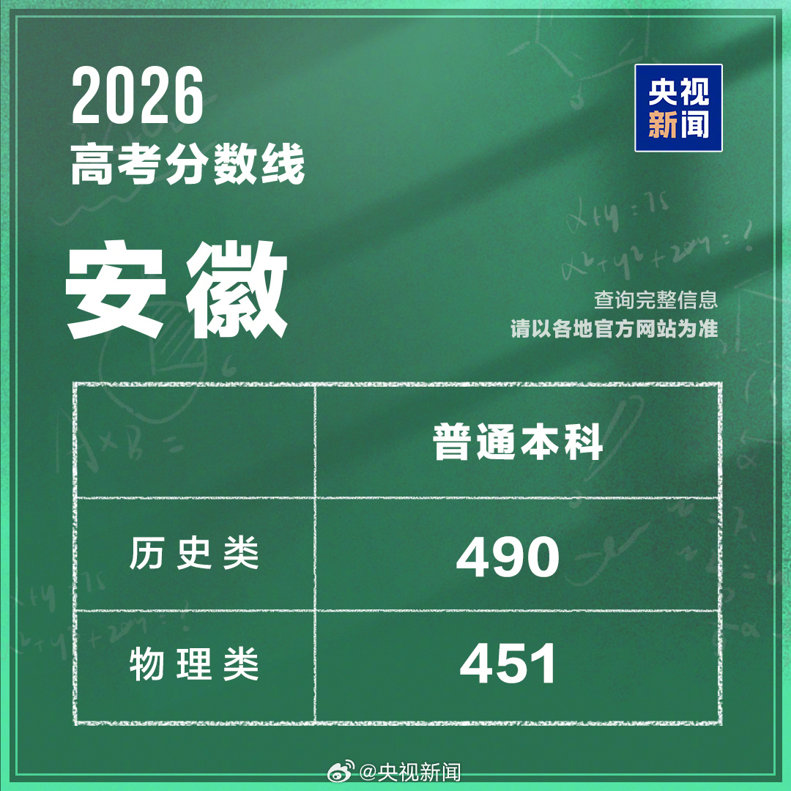

# 安徽分数线出了，但你可能看错了

今天安徽出分。

物理类451，比去年降10分。历史类490，比去年涨13分。

我第一反应也是理科简单了文科难了。结果翻了一圈考后帖子，完全相反。数学被骂上热搜，解析几何导数全换了出法，有人说"三年白刷了"。历史更翻车，古籍原文直接上卷，读题都要半天，背了一年也答不上。物理反而稳，跟模考一样。

历史最难，线涨了。物理最简单，线降了。

数据和体感，总有一个在撒谎。

分数线这东西，很多人当它是难度仪表盘。分高等于题简单，分低等于题难。

扯。

它就是个排位线。划的是第几名能上线，不是多少分算及格。

今年安徽考了45.1万人，比去年少了将近2万。全国报名1290万，两连降。考生少了，招生没少，双一流在扩，福耀科技大学也在扩。基数小了名额多了，分数线自然会动。

但不是均匀地在动。历史类考生在减少，物理类在增加，而且历史连降三年了。2024年安徽物理类比2023年多了近1万人，历史类少了1.2万人。人越少的赛道分数线越容易被头部拉高，这个道理其实跟找工作一样——同一个岗位申请者少的时候，分数线反而水涨船高。

扯远了。回到高考。，物理类在增加，历史连降三年了。2024年安徽物理类比2023年多了近1万人，历史类少了1.2万人。人越少的赛道，分数线越容易被头部拉高。

我邻居家孩子今年考了480，历史类，差一分都睡不着。我查了一下，480在去年是超本科线的。今年差10分。这孩子不是不够努力，是规则变了。

历史类线涨了，不是题简单。是考历史的人少了，留下的人本来就强。还在选历史的，很多是真擅长文科的人。跟理科不好才选历史是两拨人了。物理类线降了，不是题变简单。是考物理的人多了，招生也扩了。

分数线的涨跌，反映赛道结构和招生计划的变化。

不是难度。

上面这些稍微想想就明白。

但分数线会反过来改变你对"努力"的判断，这个容易被忽略。物理线降了，你考了460上线了觉得还行。但460的位次很可能比去年同分更低。卷子简单高分多，大家都在涨。历史线490，你考了480差10分，心里不是滋味。但同一分数，隔一年，意义完全不同。

分数线给你一个锚点，让你跟线比，不跟排位比。但录取看的是排位。

还有更深的。

有微博博主说"今年给我最直观的感受就是题难"，但一看河南600分以上有37544人。题难和分高同时存在，看起来矛盾，其实是因为考试方式变了。

安徽数学不考机械计算了改考多想少算。刷题背模板的模式大面积失效。物理稳是因为省内物理教学不走题海，讲基础吃透概念，跟新考题底层逻辑恰恰对上了。我有个朋友在合肥当高中老师，他说数学卷子出来后教研组开会，大家面面相觑。"教了十年的题全白教了"——他原话。

游戏规则在换。这个变化，分数线读不出来。

我反正觉得分数线就是个快照。它告诉你排第几能上车，不会告诉你车跑多快、路多堵、这条路是不是马上要改道了。
