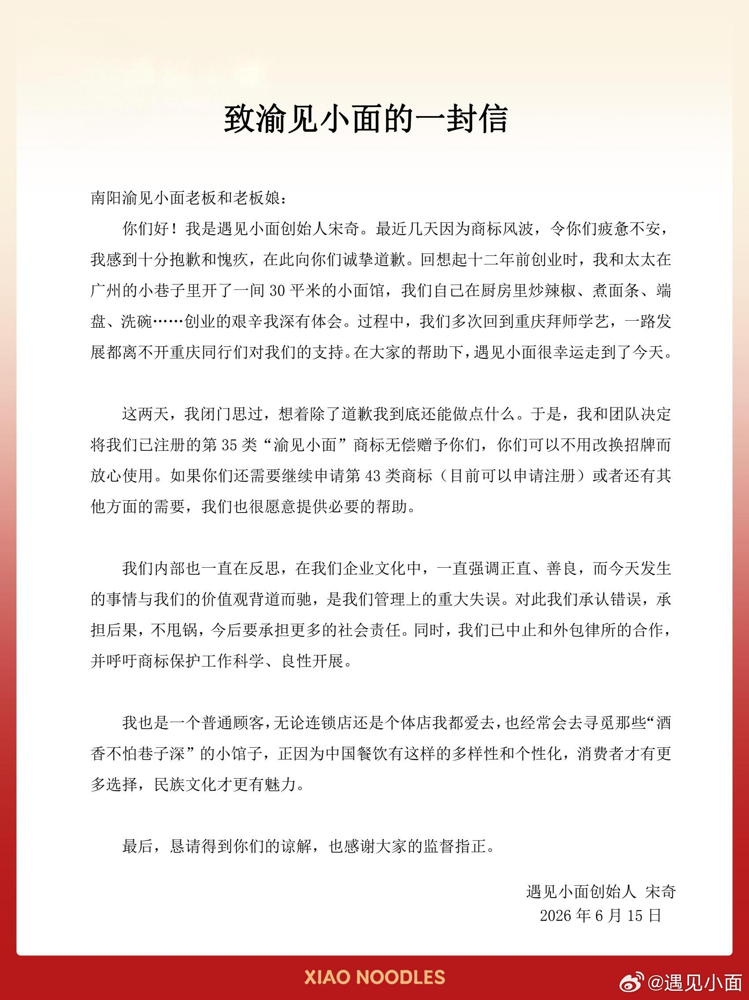
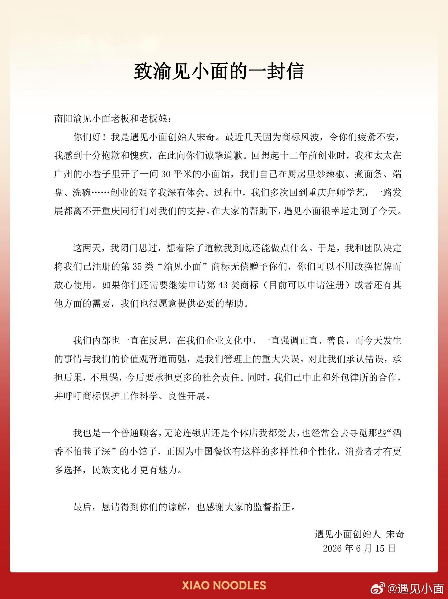

今天刷微博的时候看到一条热搜，"遇见小面创始人致歉"，点进去一看，愣了一下。

事情是这样的。南阳有对夫妻开了家小面馆，叫"渝见小面"，卖八块钱一碗的小面，开了两年，日子过得安安静静。然后连锁品牌"遇见小面"的外包律所找上门了，说人家商标侵权，索赔一万块。一万块。对一家八块钱一碗面的店来说，这不是要命吗？

老板娘后来在网上发了段视频，哭着说不知道该怎么办。视频传开了，舆论一下炸了。

"遇见小面"那边估计也没想到事情会闹这么大，6月15号，创始人宋奇发了封公开道歉信，说决定把已经注册的"渝见小面"商标无偿赠予对方，还中止了和外包律所的合作。信写得很诚恳，"闭门思过"、"除了道歉还能做点什么"。但我看完总觉得哪里不对。

我现在跟你说，也不一定就对。但这事的走向特别典型。

你可能不知道，现在有一整套成熟的"商标维权"生意。注册一堆近似商标，然后用系统自动筛查，发现有小店名字碰上了，就发律师函索赔，几千到几万不等，很多小店直接给钱了事，因为打官司太贵太折腾。

"渝见小面"的老板是重庆人，"渝"就是重庆的简称，人家拿自己家乡的名字给自己店取名，卖了两年的面，突然被一家连锁品牌告了。而"遇见小面"三个创始人都是华南理工校友，拿了资本做连锁，转过头来告一家八块钱的小店。

有个律师博主说得挺到位：从法理上讲，"遇见小面"确实手握注册商标，走法律程序没问题。但法律是底线，不是天花板。

潇湘晨报的标题更直白："遇见小面哪怕赢了官司也会输了口碑"。

评论区更热闹。有人说"遇见小便"，有人说"踢到钢板了"，还有人调侃"宋奇宋奇，送钱送商标"。最狠的一条我截了：他不是知道错了，是知道要死了。这话糙理不糙。你想想，事情没闹大的时候，律师函直接发过去了，小店大概率掏钱消灾。这次是因为老板娘的视频传开了，上了热搜，"遇见小面"才赶紧道歉送商标。

要是没上网呢？

还有个细节挺值得品的。"遇见小面"说用的是"外包律所"，言下之意是律所自作主张，品牌方不知情。但信里又说自己"闭门思过"，这俩说法搁一块儿，怎么听怎么别扭。你要真不知情，思的哪门子过？其实餐饮行业这种事不少。早几年有"青花椒"商标案，上海一家公司告了四川几十家用"青花椒"做店名的餐馆。还有"潼关肉夹馍"、"逍遥镇胡辣汤"，都是拿着商标找小店要钱。每次闹上热搜，大家骂一顿，然后呢？然后过一段时间又来一次。每次都是那套：发酵、舆论、道歉、安静。下次再换个品牌来一遍。

这次"遇见小面"反应倒是快，道歉、送商标、切割律所，三步走干净利落。但公众不太买账，因为大家看明白了，这不是"知错就改"，是"止损"。股价、口碑、品牌形象，哪个不比一万块值钱？

商标制度本身没问题，它是为了保护品牌不被山寨。但现在有些人把它玩成了生意，专门靠碰瓷小店赚赔偿。这种操作在法律上可能挑不出毛病，但它消耗的是整个社会的信任。

下次你路过一家小店，看见招牌上写着什么"正宗"、"老字号"，别急着感动。

先想想，这名字是不是从别人那儿买来的。

