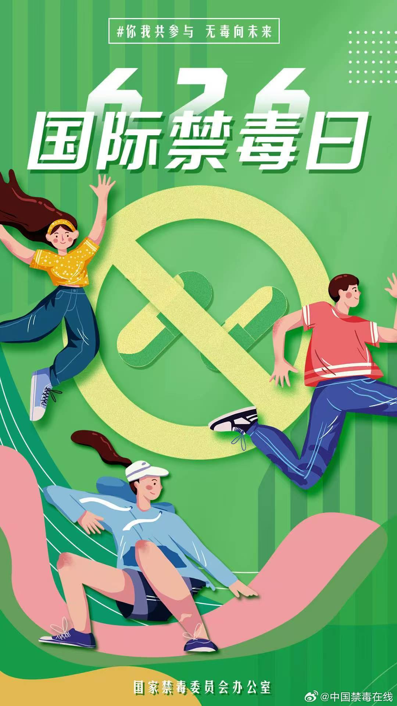
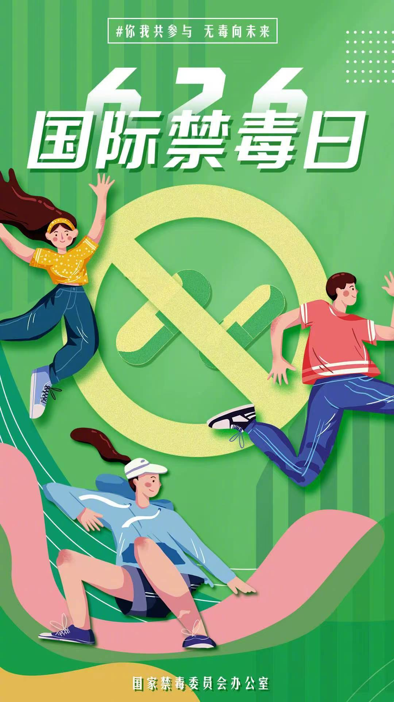
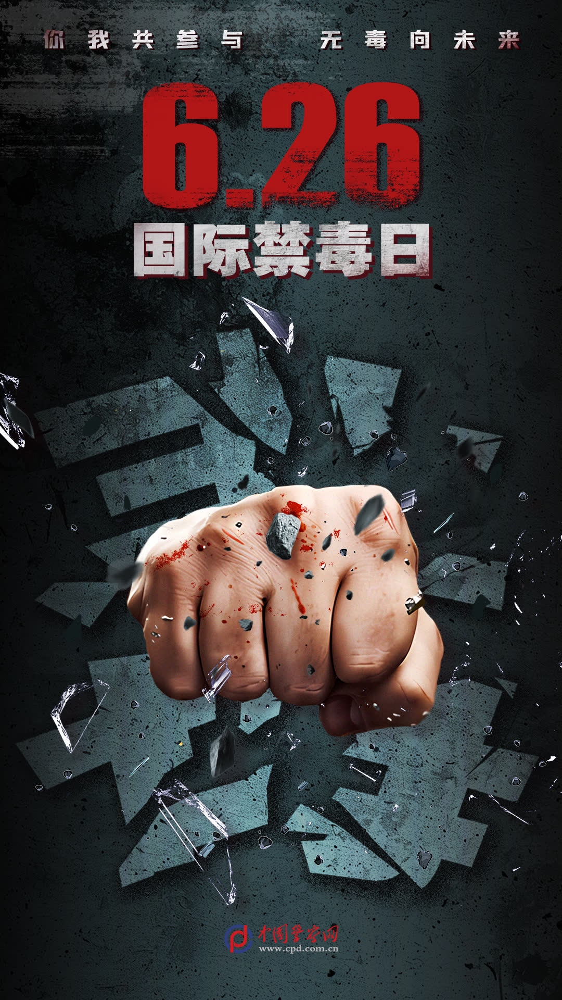

# 那些藏在奶茶里的东西

我表妹今年高一，上周她给我看班级群里的截图。有个同学在群里问："有没有人要减肥糖？进口的，效果特别好。"配图是一盒花花绿绿的糖果，包装挺精致，看着就像朋友圈代购会卖的那种零食。表妹说她差点就信了，因为她最近确实在减肥。我没接话，但心里咯噔一下。不是因为她差点买减肥糖，而是因为"减肥糖"这三个字，在禁毒宣传里出现过太多次了。

我查了一下资料，所谓"减肥糖"，有些确实是普通糖果加了泻药，吃了拉肚子，体重暂时下去，反弹的时候比原来还重。但更可怕的是，有些"减肥糖"里面掺了新型毒品，比如γ-羟丁酸，俗称"液体迷魂药"，无色无味，溶在水里根本喝不出来。一次过量就可能致死。

这种东西，就藏在你家孩子的零食柜里。

今天的微博热搜，都是关于禁毒日的。我翻了翻，发现很多地方公安都在发短视频，讲的是毒品怎么伪装成日常用品。奶茶包、跳跳糖、巧克力、电子烟、止咳水……你能想到的日常食物和饮料，毒品都能伪装成。有个广东高院发的微电影叫《戒断》，讲的是依托咪酯还没被列管的时候，一个高二生成绩下滑后被诱吸，坠楼了。一个大四女生在KTV被诱吸后遭遇侵害。一个富家子弟毒驾，两死一伤。最让人心寒的是，被告人最后只被判了一年，因为那时候依托咪酯还没被正式列为毒品，只能按非法经营罪判。受害者家属当庭痛斥"法律不公"。一年。两条人命加一个被侵害的女孩，换来的是一年刑期。

现在依托咪酯已经被列管了，但新的伪装又出现了。

电子烟是重灾区，我表妹说她们班好几个同学都抽电子烟，说是"水果味的，没有尼古丁"。但你永远不知道那烟油里加了什么。我后来跟我妈说了这件事，我妈说："你表妹才十五岁，她懂什么？"是啊，十五岁懂什么。十五岁的时候，我也觉得毒品离我很远，觉得那些吸毒的人都是自作自受，跟我没关系。但十五岁的孩子，正是最容易被影响的年纪。同桌说"这个很酷"，学长说"试一次没关系"，网友说"不上瘾的"，她可能就真的信了。

算了吧，道理谁都懂。

我翻了翻今天的微博，共青团中央发的那条有两百多条评论。有个评论说："我儿子今年中考，前几天他跟我说，他们班有人在卖'聪明药'，吃了能提高注意力，考试考得好。"聪明药。又是这种听起来无害的名字。我查了一下，所谓的"聪明药"，学名利他林，是一种治疗注意力缺陷多动障碍的处方药。正常剂量下确实能提高注意力，但一旦成瘾，剂量会越用越大，停药后会出现严重的戒断反应：焦虑、抑郁、失眠、暴力倾向。十五岁的孩子，吃了这个，短期可能成绩真的上去了，家长高兴，老师表扬。但长期呢？成瘾了呢？谁来负责？

没答案。

我后来给表妹发了条微信，没说什么大道理，就一句话："你同学问你买减肥糖的时候，你跟她说，这个东西可能有问题，别买。"表妹回了个"哦"。我也不知道她有没有听进去。十五岁的小孩，你跟她讲法律条文、讲毒品危害，她可能左耳进右耳出。但你跟她说"这个东西可能有问题"，她可能会多想一秒。

那一秒就够了。

今天是国际禁毒日，微博上到处都是"珍爱生命，远离毒品"。这些话年年说，年年说，说到最后大家都麻木了。但毒品没麻木，它还在换新包装，换新名字，换新销售渠道。从奶茶到跳跳糖，从电子烟到减肥药，从KTV到学校门口的小卖部。它离你家孩子，可能只有一包零食的距离。你能做的，就是让她知道：这个东西可能有问题，别买。不是教育，不是说教，就是一句话。
