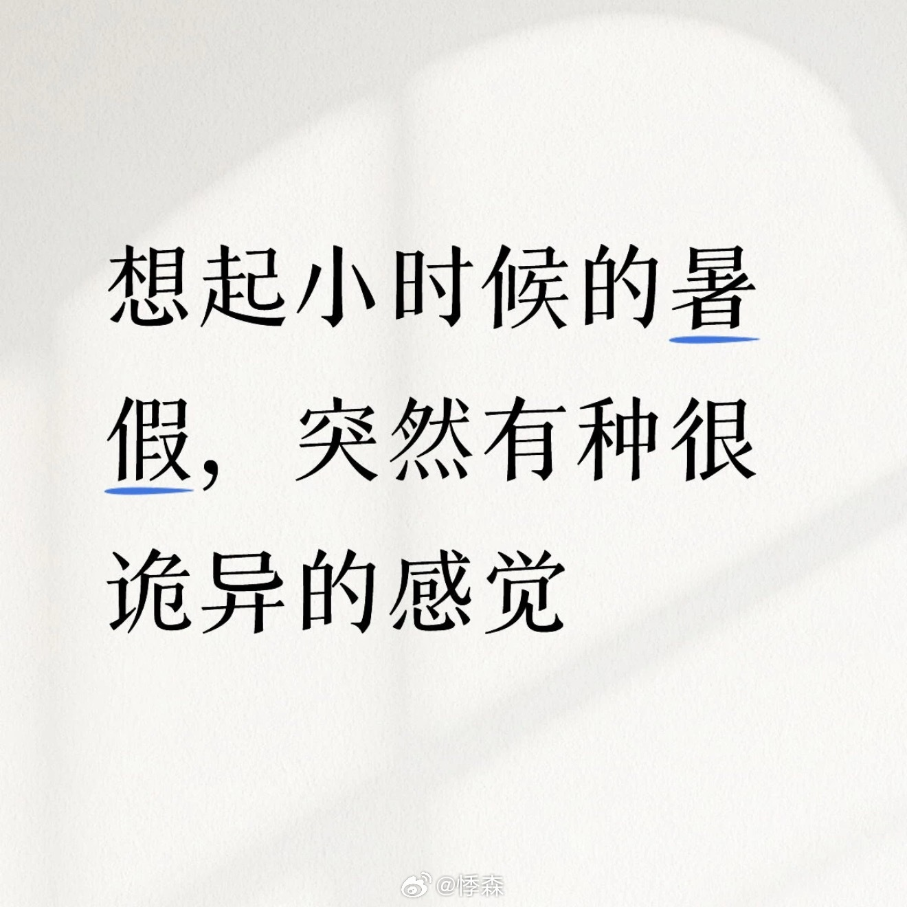
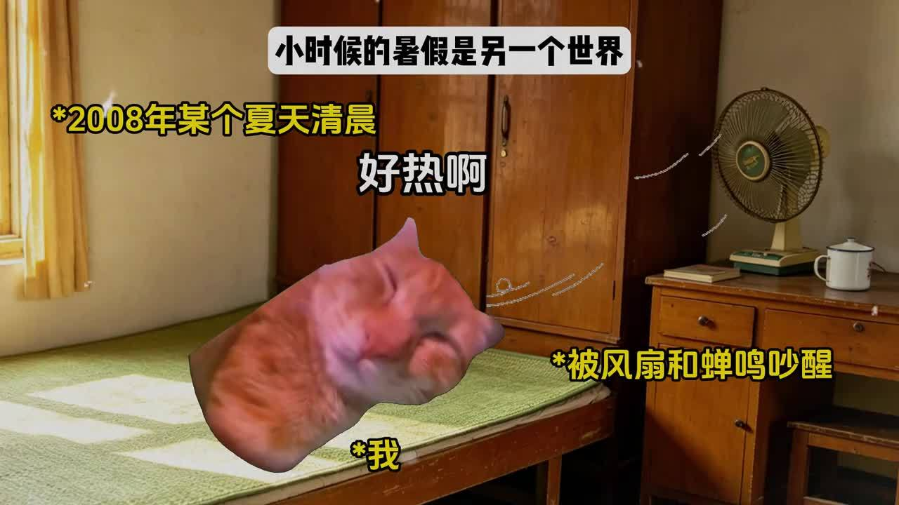
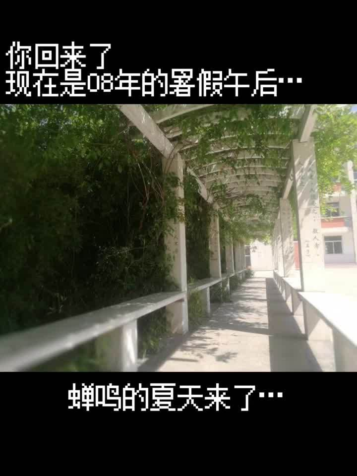

记忆里小时候的暑假，最诡异的是下午两点。

那个时间点，大人都在午睡。客厅的吊扇嗡嗡转着，电线上拴着一条红布条。窗帘拉了一半，另一半透进来的阳光在地上切出一道明晃晃的亮带，光里飘着细细的灰尘。

没有人说话。整栋楼都睡着了。

我躺在竹席上，盯着天花板上一块水渍。那片水渍看了五年，从圆形看成了一个人脸，人脸看久了又不像人脸。翻身的时候竹席黏在胳膊上，嘶啦一声揭起来。然后继续盯。时间长得不像话。一个下午像一个世纪那么长，但又不知道拿它怎么办。电视只有三个台，一个在放西游记，一个在放还珠格格，第三个在放雪花。对，就是雪花。那个年代看电视看到最后，屏幕上全是雪花点，沙沙沙，也没有人去关。

村口的蝉叫起来像一台坏掉的机器。不是悦耳的，是刺耳的、持续不断的、让人脑子发木的那种声浪。整个村子都罩在这片声浪底下，热浪从柏油路上蒸腾起来，远处的树扭曲变形。

我有时候会想，那种诡异感到底是什么。

不是害怕。不是孤独。更像——世界突然变慢了，慢到你能看见时间的颗粒。周围的一切都在正常运转，蝉在叫，风扇在转，太阳在晒，但你觉得自己被留在了另一个时空里。跟什么都隔着一层。

昨天刷微博，看见一个叫悸森的博主发了条帖子：「小时候的暑假有种很诡异的感觉。」就这一句话，五千多个赞，三百多条评论。大家都在认。

「就是突然不知道该干什么了，整个世界都空旷了。」一个湖南的网友说，她小时候在农村，阴凉的瓦屋里，门外面是大太阳和蝉鸣，那种感觉跟现在一个人呆着完全不一样。

还有人说，那种诡异感说白了就是没互联网给惯出来的。没有手机刷、没有游戏耗时间，漫漫长夏全靠眼睛耳朵和脑子自己找乐子。连风吹树叶都能脑补出一出大戏。

我觉得说得有道理，但不完全是。那个时候的暑假，每一天都长得离谱，但过完以后回头一看，两个月又一下子就没了。时间的感觉是扭曲的。这种扭曲，现在不会再有了。现在的每一天都很短，但累。以前的每一天都很长，但不累。长到你必须在下午两点跟自己的影子玩，长到你数清了天花板上每一块水渍的形状，长到你开始认真思考门口那棵苦楝树到底在想什么。

那时候的暑假还有一个诡异的地方——大人完全不知道你一天在干什么。

早上出门，说一句「我去找某某玩了」，然后消失一整天。去了哪里，做了什么，有没有吃饭，大人一概不问。傍晚回来，一身汗一身土，脏得不行，但他们也不问。好像暑假里的小孩是一个自成一体的种族，在大人看不见的地方过着自己的生活。

那种自由现在想想挺不可思议的。一个八九岁的小孩，早上骑着自行车出门，骑到河边、骑到铁路边、骑到离家五公里的镇上，没有手机，没有任何联系方式，就这么在世界上乱晃。你要是跟现在的家长说，你家小孩暑假可以这样过，他们会以为你疯了。

最怪的其实是记忆本身。现在回想暑假，脑子里全是画面，没有声音。画面还都加了滤镜，黄黄的、亮得晃眼睛。午后的街道一个人都没有，阳光白得发蓝。你自己的影子缩成一个黑点踩在脚下，你觉得自己是那段时间里唯一在动的东西。

那条微博底下一个博主总结得挺准：「正午是独属于小孩的异次元。烈日灼空，蝉声轰鸣，整条街道空无一人。所有离奇都诞生在无人看管的午后。等黄昏降温，一切回归平常。」

每一条都认。

我现在已经很多年没有经历过漫长的、无事可做的下午了。手机里有无穷无尽的东西可以刷，信息把每一秒钟都填得严严实实。再也不会躺在竹席上看天花板水渍了，再也不会觉得一个下午有一个世纪那么长了。

有时候还挺想那种诡异感的。
