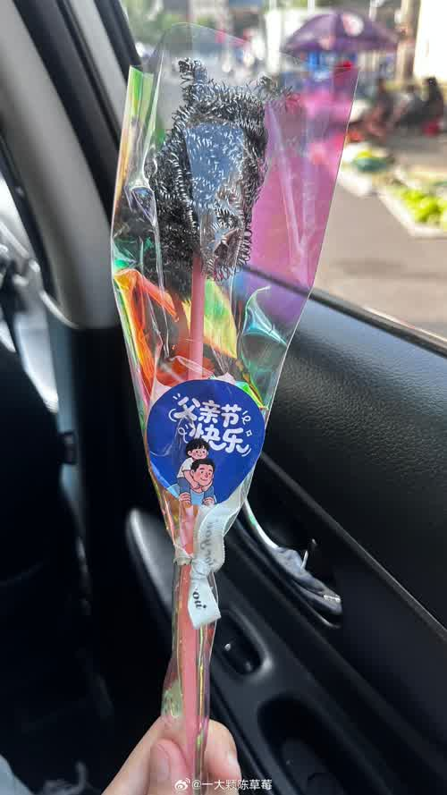

每年父亲节，网上就出现两拨人：一拨晒给老爸买的礼物，温馨感人；另一拨就更有意思了，集体分享自己送礼物翻车的惨状。

我翻了翻微博这两天关于父亲节翻车的讨论，发现翻车形式之丰富，简直可以出一个展览。

先从一个最离谱的说起。有位网友给爸爸网购了父亲节礼物，物流显示已签收，可老爸说没收到。查了监控发现，快递员把东西放在了同小区另一栋楼的门口。等她找到那户人家时，人家已经把包装拆了，说"以为是自己儿子买的"。最绝的是那东西：一箱成人纸尿裤。隔着屏幕都能抠出三室一厅。

还有更小的翻车选手。幼儿园组织小朋友给爸爸做父亲节礼物，有位小姑娘回家兴冲冲地拿给爸爸一个钢丝球。爸爸当场愣住了。妈妈后来发微博说，头天晚上她爸做家务时一直在找钢丝球，嘴里念叨"钢丝球去哪儿了"，第二天闺女就给他送了一个。他爸在家自言自语："还得是养闺女啊。"

也有大孩子的翻车，走的是逻辑流。一个小学生跟妈妈商量父亲节礼物，说想送爸爸一副耳机。妈妈问为什么，他说因为爸爸打呼噜太响了，戴上耳机就听不到了。还有一家兄弟姐妹操作更绝，给家里的几位老父亲过父亲节，准备了一整套试卷和准考证，让老爸们现场考试，据说还设了监考老师。照片上几个中年男人坐在桌前对着卷子挠头，一看就是亲生的。

如果这些还算温馨翻车，那下面这位的处境就有点玄学了。一位网友发帖说："忒搞笑，准是看着我父亲节没给我爹买礼物，今天一早晨手机就摔了。"还有人说"前几天给我爸发过红包，父亲节就不送了"，被妈妈笑了一通。跟老师说"上周交过作业了这周不交"有什么区别。

成年人送礼翻车的经典款，发生在一位博主身上。她每年618蹲点凑满减，给老爸买礼物。有一年买的按摩仪，老爸收到后说"我用不上"，她说"可以退"，老爸说"算了，留着吧"。那个按摩仪在柜子里放了三年，包装都没拆。后来她学乖了，父亲节直接发红包。结果老爸收了红包，转头给老妈转过去了。

还有一个更冤的。小伙子攒钱想给老爸报个豪华邮轮十日游，结果看岔了，给报成了老年团。两位中年父亲被挤在一群老人中间，格外显眼。

送实物被闲置，送钱被上缴。钢丝球、耳机、纸尿裤、按摩仪、邮轮老年团……每个翻车现场背后，出发点都是认真的。

反正你爸一边嘴上说"买这干啥浪费钱"，一边转身就发朋友圈了。

