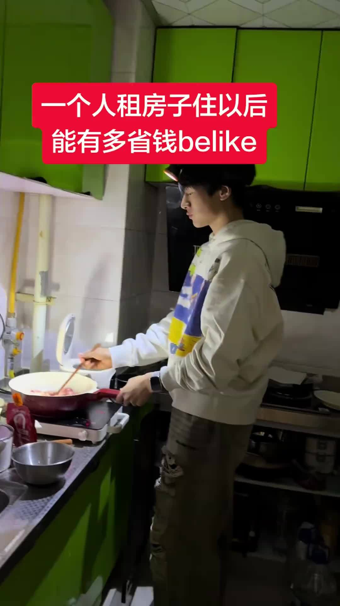

# 一个人租房住能有多省钱

今天微博上这个话题冲上了热搜。我刷了半小时，发现评论区正在激烈地分成两派。

一派说自己租房以后省钱省到变态。另一派说你们别天真了，一个人住根本不省钱。

两派都觉得自己是对的。

先说省钱的。搬砖少女郑乙夏发了个视频，她有493万粉丝，视频里列举了一堆省钱操作：不买奶茶自己泡茶包，周末不出门躺着不动就没消费，外卖凑满减要凑半小时。评论区有人补充说，自己一个人住以后外卖比做饭还省钱，因为去买菜路上一定会奖励自己一堆零食，最后反而花得更多。还有人说之前觉得爸妈已经够省了，结果自己搬出来住才发现，什么叫做真正的极致抠门。

但你翻一下另一派的评论，你会发现他们也在说实话。

新锐X科技侠那条被顶到很高的评论我是看了好几遍的。他说，自己租房的都知道，纯算经济账，独居并不省钱，甚至是奢侈的。房租水电一个人扛，没人和你分摊网费，连着买瓶大瓶洗发水都用得比别人慢。独居省下的从来不是钱，而是自己的情绪劳动和精气神。

这个角度我想了一下。确实，住家里不用交房租，一日三餐有人做，水电物业跟你不相干。真从现金流角度算，租房在任何情况下都是支出增加。说省钱，是在跟自己的物欲抗争，跟自己随时想点外卖的手抗争，跟那个一进超市就忍不住逛的腿抗争。一个人住的时候，你面对的唯一对象就是你自己，所有的诱惑都摆在面前，能挡住才是本事。

所以这个问题的答案其实很简单。租房当然不便宜，它只是给你一个"我可以随心所欲花钱"的自由。然后你发现，有了这个自由，你反而开始自动算账了。

有一个香港的博主留言说，大部分香港打工者都是租房，丰俭由人，收入高不代表存款高。这句话放到内地也一样。月薪两万能存多少，取决于你对自己的掌控力，不取决于房租是多少。

我有个朋友在广州租房，月薪八千出头。他为了省钱，租了一个城中村的单间，月租加上水电大概一千出头，没有厨房。每天早上出门买两个包子一杯豆浆，中午公司楼下15块的快餐，晚上回去泡面或者叫一份八块钱的肠粉。周末偶尔奢侈一把，买点卤味和啤酒回来看剧。他跟我说，一个月吃饭控制在800块以内，加上房租物业日常开销，总支出不超过2500。剩下五千多全存着。

我说你不无聊吗。他说一个人住习惯了，反而挺自在的。

但另一个在深圳的前同事就不一样了。她一开始也是这个思路，租房预算卡得死死的。后来发现晚上回去面对四面墙太难受了，开始频繁约朋友吃饭、周末去咖啡店坐半天、买各种小家具和装饰来填空房间。三个月以后算了一笔账，支出比预算超出60%。

她说，与其说省钱，不如说独居是对自己消费观的摸底考试。考过了当然能存钱，考砸了也是一次清醒。租房嘛，你租的不是一个住的地方，是一个跟你自己相处的机会。

网上还有人说，租房再不省钱，也不买房。这话现在越来越多人认同。当房价高到一定程度，选择租房本身就是一种理性的财务决策。你不用掏空六个钱包，不用背负三十年的贷款，每个月的现金流是可控的。这不是省钱不省钱的问题，是选择一种什么样的活法的问题。

一个人租房住能有多省钱。答案其实挺简单的。想省钱，怎么住都能省。不想省，住哪里都攒不下。

但问题是，凭什么非得这么省呢。

